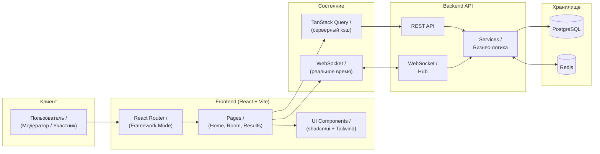

<div align="center">

# Poker Planning

**Инструмент для проведения планирования покером в реальном времени**

[](https://react.dev/)
[](https://vite.dev/)
[](https://www.typescriptlang.org/)
[](https://tailwindcss.com/)

</div>

---

## Содержание

- [О проекте](#о-проекте)
- [Технологический стек](#технологический-стек)
- [Архитектура](#архитектура)
- [Быстрый старт](#быстрый-старт)
- [Команды](#команды)

---

## О проекте

### Проблема

Проведение планирования покером в распределённых командах требует синхронизации участников, ручного подсчёта карт и часто приводит к рассинхрону при голосовании.

### Решение

**Poker Planning** — веб-приложение для оценки задач методом Planning Poker. Команда создаёт комнату, участники голосуют картами в реальном времени через WebSocket, результаты синхронизируются мгновенно для всех участников.

### Аудитория

- Разработчики
- Scrum-команды
- Тимлиды

---

## Технологический стек

<div align="center">

| **Категория** | **Технологии** | **Версия / Детали** |
|:---:|:---:|:---:|
| Фреймворк | React, TypeScript | React 19+ |
| Сборка | Vite | 6+ |
| Роутинг | React Router (Framework Mode) | 7+ |
| Серверный стейт | TanStack Query | 5+ |
| HTTP-клиент | Axios | 1.13+ |
| Стили | Tailwind CSS | 4+ |
| UI-компоненты | shadcn/ui | — |
| Анимации | Framer Motion | 12+ |
| Реальное время | WebSocket | — |
| Валидация | Zod + React Hook Form | — |
| Иконки | Lucide React | — |
| Линтинг | ESLint + Prettier + Stylelint | — |
| Git-хуки | Husky + lint-staged | — |

</div>

---

## Архитектура



---

## Быстрый старт

### Требования

<div align="center">

| Компонент | Минимум | Рекомендуется |
|:---:|:---:|:---:|
| Node.js | 18.18+ | 20+ |
| pnpm | 8+ | 9+ |

</div>

### Клонирование репозитория

```bash
git clone https://github.com/your-org/poker-planning.git

cd poker-planning
```

### Установка зависимостей

```bash
pnpm install
```

### Запуск приложения

```bash
pnpm dev
```

### Настройки по умолчанию

- Frontend: `http://localhost:5173`
- Backend API: `http://localhost:8000`
- WebSocket: `ws://localhost:8000/ws`

---

## Команды

### Frontend (Vite)

```bash
# Запуск dev-сервера (http://localhost:5173)
pnpm dev

# Production-сборка
pnpm build

# Запуск production-сборки
pnpm start

# Предпросмотр production-сборки
pnpm preview

# Линтинг
pnpm lint

# Форматирование кода
pnpm format

# Проверка типов TypeScript
pnpm typecheck
```