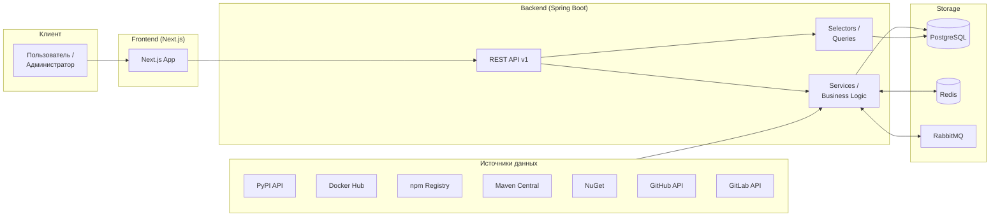

<div align="center">

# StackScout

**Интеллектуальная платформа для анализа Open Source библиотек**

[](https://nextjs.org/)
[](https://spring.io/projects/spring-boot)
[](https://www.docker.com/)
[](https://github.com/Zero-Logic-Education/StackScout/actions/workflows/ci.yml)

</div>

---

## Содержание

- [О проекте](#о-проекте)
- [Технологический стек](#технологический-стек)
- [Архитектура](#архитектура)
- [Быстрый старт](#быстрый-старт)
- [Команды](#команды)

---

## О проекте

### Проблема: Dependency Hell

Современная разработка программного обеспечения во многом зависит от сторонних библиотек. Однако выбор правильной зависимости представляет серьёзную проблему: уязвимости, конфликты лицензий и риски поддержки.

### Решение: StackScout

**StackScout** — это комплексная платформа для **управления программными активами (Software Asset Management)**. Она автоматизирует сбор, анализ и мониторинг open-source библиотек, предоставляя оценку их «здоровья» и юридической чистоты.

---

## Технологический стек

<div align="center">

| **Категория** | **Технологии** | **Версия / Детали** |
|:---:|:---:|:---:|
| Backend | Java, Spring Boot, Spring Security, Spring Data JPA | Java 21, Spring Boot 3.5 |
| База данных | PostgreSQL, Redis, RabbitMQ | PostgreSQL 16, Redis 7+ |
| Frontend | Next.js, React, Material UI, TypeScript | Next.js 16, React 19, MUI 7 |
| Инфраструктура | Docker, Docker Compose, GitHub Actions | — |
| Мониторинг | Prometheus, Grafana | — |

</div>

---

## Архитектура



---

## Быстрый старт

### Требования

<div align="center">

| Компонент | Минимум | Рекомендуется |
|:---:|:---:|:---:|
| Java | 21+ | 21 |
| Node.js | 18.18+ | 20+ |
| pnpm | 8+ | Latest |
| Docker | 24+ | Latest |
| Docker Compose | 2.20+ | Latest |
</div>

### Клонирование репозитория

```bash
git clone https://github.com/Zero-Logic-Education/StackScout.git

cd stackscout
```

### Настройки по умолчанию:

- PostgreSQL: `localhost:5433` / `postgres` / `postgres`
- Redis: `localhost:6379`
- RabbitMQ: `localhost:5672` / `guest` / `guest`
- Backend API: `http://localhost:8081`

### 3. Запуск инфраструктуры

```bash
# Сборка и запуск
docker compose up -d --build

# Статус
docker compose ps
```

---

## Команды

### Backend (Gradle)

```bash
# Сборка проекта
cd backend && ./gradlew build

# Запуск в режиме разработки
cd backend && ./gradlew bootRun

# Запуск тестов
cd backend && ./gradlew test

# Сборка без тестов
cd backend && ./gradlew build -x test

# Очистка артефактов сборки
cd backend && ./gradlew clean
```

### Frontend (pnpm)

```bash
# Установка зависимостей
cd frontend && pnpm install

# Запуск dev-сервера (http://localhost:3000)
cd frontend && pnpm dev

# Сборка для production
cd frontend && pnpm build

# Запуск production-сборки
cd frontend && pnpm start

# Линтинг
cd frontend && pnpm lint
```

### Docker

```bash
# Запустить все сервисы инфраструктуры
docker compose up -d

# Остановить все сервисы
docker compose down

# Пересобрать образы и запустить
docker compose up -d --build

# Логи конкретного сервиса
docker compose logs -f postgres
docker compose logs -f redis

# Полная очистка (включая volumes)
docker compose down -v
```

### Docker через pnpm (из корня проекта)

```bash
# Сборка docker-образов
pnpm docker:build

# Запуск контейнеров
pnpm docker:up

# Пересобрать и запустить
pnpm docker:up:build

# Остановить контейнеры
pnpm docker:down

# Логи (передайте имя сервиса после --)
pnpm docker:logs -- frontend
pnpm docker:logs -- app
```